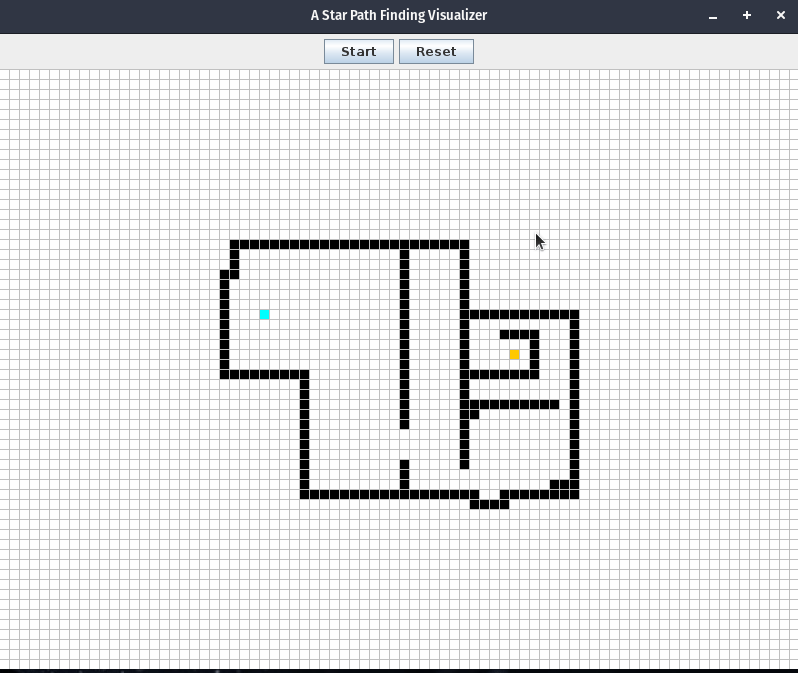

# A-Path-Finder-Visualizer
Draw obstacles, move the starting and target nodes, and watch the A* path finder try to find the optimal path!

A Java program that utilizes awt and swing toolkits to display a simple graphical user interface.

At the top of the application are JButtons: "Start", "Reset"
And, in the center is a large grid (Jpanel) to display the visualization. In this grid, the user can drag around
the starting and target nodes and draw obstacles. Once the user is satisfied with their maze, starting, and
ending node locations, the user can start the algorithm and watch the A* path finder algorithm execute
and try to find the optimal path

Note: You can not place a starting or ending node on an obstacle node, and vice versa.

### How to run the program

Since the project does not use any 3rd party libraries, you can simply compile all the .java files within the
source folder in the repository, and run the program. The file that executes main is called InitiateProgram

Example:
(To compile the project, note: *.java will compile all files in the directory with the .java extension, you can
manually list the project's .java files if you desire)
javac *.java

(To run the project)
java InitiateProgram

If there are any issues, please let me know! 

- Briggs
